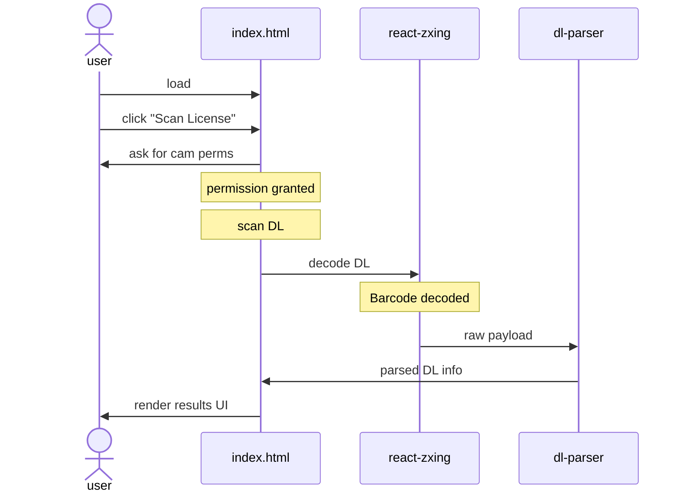

# DLscan

The working application can be used at: [http://dlscan.netlify.app](http://dlscan.netlify.app)

## About This Project

A simple application that allows users to use their webcams to scan their driver license and then view information extracted from it in a minimalistic user interface. It works by scanning the PDF417 barcode found on the back of a USA-issued driver license. The PDF417 barcode contains all the info that can be seen on the front of the license/ID card.

The scan will only display full name, address, issue and expiration dates, but more extracted information can be found in your browser's console inside a JS object. This hidden information is raw and unparsed.

## Installation and Setup Instructions to Run Locally

Clone this repository. You will need `node` and `npm` installed on your machine.

Installation:

    `npm install`

To run dev Server:

    `npm run dev`

To Visit App:

    `localhost:5173/`

The React app can also be built into a "/dist" directory.

To build App:

    `npm run build`

To Visit App:

    `npm preview`

    then

    Your CLI will display the local IP address and port that the app can be viewed on.

## Technologies

### Vite

- **What?:** [Vite](https://vitejs.dev/) is a local development server that uses Rollup and esbuild internally for bundling of Vue and React apps.
- **Why?:** Vite is a personal preference of mine, it allows me to quickly set up a react app in just a few CLI commands. Furthermore, it comes with an easy to run dev server which helps tremendously when developing.

### React

- **What?:** [React](https://react.dev/) is an open-source Javascript library/framework for building user interfaces based on components.
- **Why?:** This application was simple enough that it could have been built in pure Javascript/HTML/CSS. So why did I decide to add an extra dependency and build step? Futureproofing, usually a feature like this would be part of a much bigger and more complex application. This is where react begins to shine, making it easier to organize components and keep track of data. So if we wish to expand on this application we can do so while promoting code reusability, and provide a scalable and flexible development process.

### Tailwind with DaisyUI

- **What?:** [Tailwind](): An open-source CSS framework. [DaisyUI](https://daisyui.com/): a component library plugin for Tailwind.
- **Why?:** This is another personal preference. Tailwind + DaisyUI lets me quickly apply styles directly in my react components but also comes with pre-styled components that I can use for rapid prototyping and MVPs.

### Libraries

- [react-zxing](https://github.com/adamalfredsson/react-zxing): Decodes a variety of barcodes from still images or live video streams.
- [driver-license-parser](https://www.npmjs.com/package/driver-license-parser): PDF417 parser for decoding driver license barcode raw data.

## Obstacles

As with any project, things do not go as smoothly as we anticipate. During the developement process I ran into a few issues.

- **Barcode recognition:** The react-xing library works great for several standards of barcodes. However, it takes longer to recognize and scan the PDF417 barcodes that are found on USA diver licenses. This is due to the driver license holding much more info than most other barcodes. The more information that is held within a PDF417 the more granular and dense the barcode becomes visually. This required me to hold the license very close to the camera to be able to scan.
- **Webcam:** As I've established above, the barcodes we are scanning are very dense. This caused issues with scanning, often holding the license to the camera for minutes with no response. I found that the only way around this was to have a high quality camera with good lighting. Cameras with the highest chance of success had atleast a 720p resolution, Auto-focusing and Auto-exposure for lighting.
- **Mobile:** Successful scan rates on mobile devices were good but not perfect. Modern mobile cameras are high resolution, auto-focusing and have exposure balancing, basically everything you need to scan. But the issue I encountered with mobile-device scans was that accessing the camera via browser did not always allow the camera to autofocus. This issue was highly device dependent.
- **Laptop:** The Laptop web cameras that I had available to me all had low resolution, no auto-focus and poor exposure balance. Because of this, I failed to get a successful scan using any laptop webcam.
- **driver-license-parser:** This was the JS library I used to parse the raw PDF417 information into an easy to read format. This library is poorly documented and to be fair "not fully tested" according to their npm page. I found that the raw data from the scan pre-parsing had tons of information. Nearly (if not all) the info that is visible on the front of the license. However, the parsing library did not extract it all and put some of it in incorrect key-value pairs. Every ounce of me wanted to write my own parser but I simply did not have the time. So as a result I only displayed the information that the parser could extract correctly and put the raw information of the scan in the console.

## Assumptions

- **Camera:** At least 720p resolution, Auto-focusing.
- **Enironment:** Good lighting.
- **License:** USA driver's license, issued on or after 2019. Licenses issued before 2019 are not guaranteed to have a PDF417 barcode.

## Project Architecture

The architecture of the project is simple, due to it being a front-end only app. After building we have a minimal app where a small amount of business logic is handled in the browser, requires no API calls to a server, and has no database. This would be considered One-tier architecture. The application flow is visualized in a sequence diagram below.

